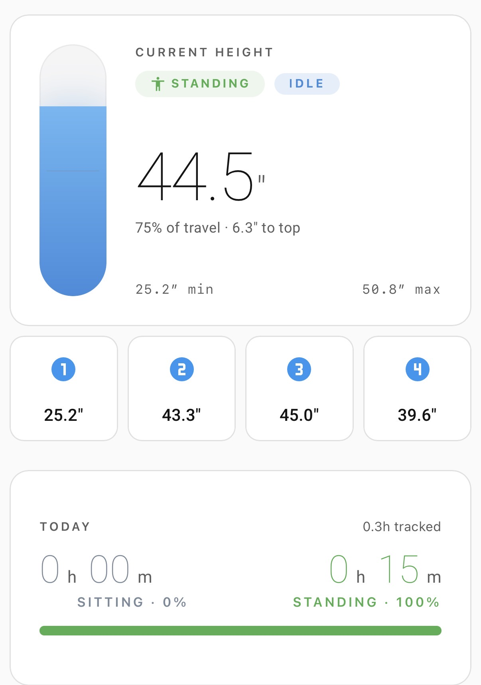
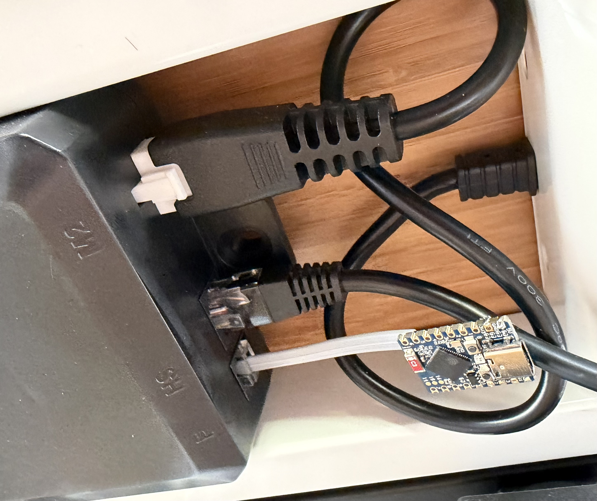

# Standing Desk Controller

Wires a Maidesite-class electric standing desk (Jarvis clones, DeskUp Pro,
Rocka, etc.) into Home Assistant via the desk's RJ12 control port. Exposes
the desk as a `cover` entity (proportional height slider) plus M1–M4 memory
buttons, nudge / stop, and an idle timer — all over WiFi, no cloud.

Builds on the protocol reverse-engineering from
[smarthomeguys/DeskUp-Pro-Controller-RJ12](https://github.com/smarthomeguys/DeskUp-Pro-Controller-RJ12).
This repo's contribution is a self-contained importable package, two patches
to the upstream's UART logic, and a polished HA dashboard for sharing.

Upstream baseline: reviewed through
[SmartHomeGuys/DeskUp-Pro-Controller-RJ12 v2026.5.0](https://github.com/SmartHomeGuys/DeskUp-Pro-Controller-RJ12/releases/tag/v2026.5.0).
The package keeps its Home Assistant entities inch-native while porting
applicable upstream firmware improvements. Local differences from upstream are
intentional: wrapper-friendly substitutions, the Rocka string-comparison fix,
and inch-native wire-boundary conversions.

<p align="center">
  
  &nbsp;&nbsp;
  
</p>

## Hardware

- ESP32-S3 Mini *(default)* or M5Stack NanoC6 *(alternate)*
- 6P6C RJ12 cable (M-M)
- 4-pin to flying-leads pigtail (Grove or Dupont) for splicing
- Heat-shrink / wire splicing supplies

The desk's 5 V rail powers the ESP through the same RJ12 cable that carries
UART, so no separate USB-C power once installed.

### Wiring

| RJ12 pin | Wire (typical) | ESP S3 Mini | ESP NanoC6 |
|---|---|---|---|
| 1 | — | n/c | n/c |
| 2 | Brown | GND | GND |
| 3 | Red — desk TX | GPIO12 (RX) | GPIO2 (RX) |
| 4 | Green — desk 5 V | 5 V | 5 V |
| 5 | Yellow — desk RX | GPIO13 (TX) | GPIO1 (TX) |
| 6 | — | n/c | n/c |

> **Verify with a multimeter.** Wire colors aren't authoritative across
> different cable manufacturers, and at least one community report has the
> colors permuted.

## ESPHome install

### 1. Clone the example wrapper

Copy [`examples/standing-desk.yaml`](examples/standing-desk.yaml) into your
ESPHome dashboard's config folder and rename it (e.g. `standing-desk-office.yaml`).

### 2. Edit substitutions

```yaml
substitutions:
  device_id: standing-desk-office       # mDNS hostname + entity prefix
  device_name: "Standing Desk"
  desk_min_height: "25.2"               # measure full-down height in inches
  desk_max_height: "50.8"               # measure full-up height in inches
  desk_config_min_height: "22.0"        # editable lower bound for Min/Max boxes
  desk_config_max_height: "54.0"        # editable upper bound for Min/Max boxes
```

If you're on hardware other than the S3 Mini, also override `board`, `tx_pin`,
`rx_pin`, and `status_led_pin` (commented examples in the wrapper).

### 3. Splice and connect

Cut the 4-pin pigtail and the RJ12 cable, splice per the wiring table above,
heat-shrink. Plug RJ12 into the desk; plug pigtail into the ESP.

### 4. Flash

First flash needs USB-C (the ESP has no firmware yet, so OTA isn't available).
ESPHome dashboard → Install → "Plug into the computer" → Manual download via
WebSerial in Chrome/Edge.

After the first flash, all subsequent updates work OTA over WiFi.

### 5. Verify

- HA auto-discovers the device via zeroconf — accept the prompt.
- Press **Nudge Up** to confirm direction. Desk should rise slightly. If it
  goes the wrong way, swap `tx_pin`/`rx_pin` in your wrapper and re-flash.
- Press a memory button (e.g. **M1**) — desk should travel to that stored
  height.
- Drag the **Height** slider — desk should track to the requested position.

If `set_height` (slider) doesn't move the desk but nudge / preset jumps do,
flip **Control Code Variant** in HA from `Default` to `Rocka` (no re-flash
needed).

If you use a Fully Jarvis/Jiecang controller and M1-M4 preset sensors report
raw motor counts instead of real heights, set **Control Code Variant** to
`Fully Jarvis`, make sure the **Min Height** and **Max Height** config boxes
match the measured full-down and full-up heights, set M1 on the physical
handset to full-down and M4 to full-up, then press **Calibrate Fully Jarvis**.
The package stores the min/max motor counts and converts future M1-M4 packets
back to inches.

To discover the desk's physical travel limits, press **Send Heights to Log** in
Home Assistant and watch the ESPHome logs or Web Server UI for the reported
minimum and maximum heights.

## Home Assistant dashboard + sit/stand tracking

The [`ha-config/`](ha-config/) folder has two assets you can drop in to get
the dashboard view shown above.

### Dashboard view

Two variants are available — pick one. Both cover the same ground (current
height, presets, controls, sit/stand stats, 24h chart); the difference is
how the hero card looks.

| File | Hero | When to pick |
|---|---|---|
| [`ha-config/dashboard.yaml`](ha-config/dashboard.yaml) | Vertical bar gauge with current-height number alongside | Compact, technical, low-key. Reads cleanly at any size. |
| [`ha-config/dashboard-illustrated.yaml`](ha-config/dashboard-illustrated.yaml) | Rendered front-view illustration of the desk (white legs + birch top) that physically rises and lowers in real time | More striking; better for sharing. Slightly taller card. |

To install either:

1. Confirm you have these HACS cards installed: **button-card**, **mushroom**,
   **apexcharts-card**.
2. Open the dashboard you want to add the view to → Edit → 3-dot menu → **Raw
   configuration editor**.
3. Open the variant you picked.
4. **Find-and-replace `<DEVICE_PREFIX>`** with your device's actual entity-id
   prefix. e.g. if `device_id: standing-desk-office`, the prefix is
   `standing_desk_office`.
5. Paste the resulting YAML as a new entry in the `views:` array. Save.

### Sit / Stand daily totals

The "Today" card on the dashboard shows hours sitting vs standing today
(>30″ = standing). Powered by HA's built-in `history_stats` platform.

1. Make sure your `configuration.yaml` is set up for packages:
   ```yaml
   homeassistant:
     packages: !include_dir_named packages
   ```
2. Drop [`ha-config/desk_sit_stand_tracker.yaml`](ha-config/desk_sit_stand_tracker.yaml)
   into `/config/packages/` on your HA host.
3. Edit the entity references inside that file to match your device's prefix.
4. **Restart Home Assistant** (the `history_stats` platform doesn't pick up
   via reload — it requires a restart).

Until restart, the dashboard's stats card shows a placeholder telling you to
install + restart.

## Customization

| Substitution | Default | Notes |
|---|---|---|
| `device_id` | `standing-desk` | mDNS hostname + entity prefix |
| `device_name` | `"Standing Desk"` | HA display name |
| `desk_min_height` | `25.2` | inches, full-down |
| `desk_max_height` | `50.8` | inches, full-up |
| `board` | `esp32-s3-devkitc-1` | override per board |
| `tx_pin` | `GPIO13` | ESP TX → desk RX (RJ12 pin 5) |
| `rx_pin` | `GPIO12` | ESP RX ← desk TX (RJ12 pin 3) |
| `status_led_pin` | `GPIO21` | WS2812 RGB. Remove the `light:` block if your board has none. |

The **Min Height** and **Max Height** number entities in HA persist across
firmware reflashes (`restore_value: true`). Set them once in HA's UI to
calibrate to your specific desk; subsequent flashes won't reset them.

## Troubleshooting

**Heights look ~2.5× too small (e.g. desk at 25″, sensor reads 9.9″).**
Your desk firmware reports millimeters, not deci-inches like the default.
In `desk-controller.yaml`, change the two `/ 10.0` divisions in the RX
lambda to `/ 25.4`, and the `* 10` in the TX lambda to `* 25.4`. The
top-of-file comments call this out.

**Nudge / preset works but slider does nothing.**
Flip the `Control Code Variant` select entity from `Default` to `Rocka`.

**Commands stop working after the desk has been idle a few minutes.**
Toggle the `Send Wake Up Cmd` switch on. The controller will send a wake-up
frame before each command if the desk's been idle 4+ s.

**M1/M2/M4 sensors show garbage values on first boot.**
The desk broadcasts buffer noise on startup that gets mapped to those slots.
Press **Set M1** with the desk at your sit height (and Set M2/M3/M4 at other
preferred heights) once. From then on, the values reflect what's actually
stored on the desk.

## Credits

- Protocol reverse-engineering and original ESPHome implementation:
  [smarthomeguys/DeskUp-Pro-Controller-RJ12](https://github.com/smarthomeguys/DeskUp-Pro-Controller-RJ12)
  ([build wiki](https://smarthomeguys.github.io/DeskUp-Pro-Controller-RJ12/))
- Dashboard cards: [button-card](https://github.com/custom-cards/button-card),
  [mushroom](https://github.com/piitaya/lovelace-mushroom),
  [apexcharts-card](https://github.com/RomRider/apexcharts-card)
