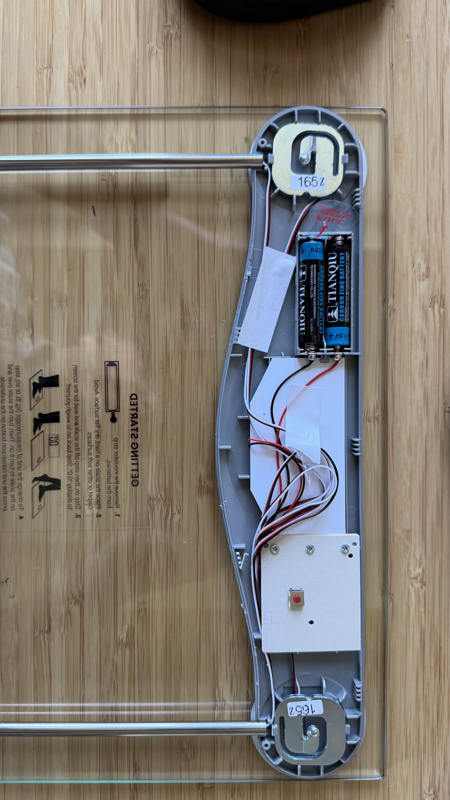
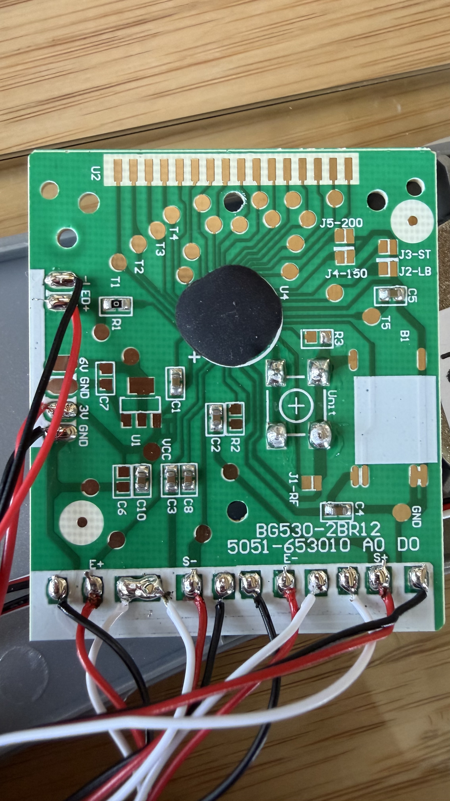

# Smart Scale

A battery-powered, two-user-aware smart bathroom scale built on ESPHome.
Reuses the chassis and load cells from a stock cheap bathroom scale; replaces
the OEM PCB with an ESP32-S3 + HX711 + OLED + accelerometer setup.

> **Status**: 🚧 In progress. Hardware ordered, firmware drafted, awaiting
> bench bring-up to capture the two HX711 calibration numbers.

Built on top of [markusressel/ESPHome-Smart-Scale](https://github.com/markusressel/ESPHome-Smart-Scale)
(CC0). Adds: deep-sleep duty cycling, motion-interrupt wake, on-OLED
real-time display, two-user routing, and an Apple Health / Whoop sync path.



## What this does differently from upstream

The Markus Ressel project assumes mains power and uses a slow auto-tare drift
to compensate for thermal shift. This build trades that for:

| Concern | Upstream | This build |
|---|---|---|
| Power | USB / mains, always on | 2×AAA + buck-boost, deep sleep |
| Wake | N/A (always on) | LIS3DH motion interrupt → ext0 |
| Tare | Slow continuous drift | Once per wake, before user steps on |
| Users | Single sensor | On-device routing to user 1 / user 2 / unknown |
| Display | None (HA dashboard only) | 2.42" OLED with weight, name, delta-vs-last |

Battery life estimate: **~3 years** on AAA alkalines or **~2 years** on AAA
NiMH (10 µA standby + ~6 weighings/day × 5 s × 80 mA active ≈ 1 mAh/day
against a 1200 mAh AAA budget).

## Hardware

### Bill of materials

| Part | Qty | Notes |
|---|---|---|
| Stock cheap bathroom scale (any brand) | 1 | Source of glass top, chassis, 4× load cells, AAA holder |
| Waveshare ESP32-S3-Mini | 1 | ESP32-S3FH4R2, 4 MB flash + 2 MB PSRAM, USB-C native ([Amazon](https://www.amazon.com/dp/B0CR2RH7PS)) |
| HX711 ADC breakout | 1 | The 24-bit load-cell ADC the upstream project uses |
| 2.42" SSD1309 128×64 I²C OLED | 1 | Fits 76 × 32 mm display window with proportional bezel |
| LIS3DH I²C accelerometer breakout | 1 | INT1 pin must be broken out (Adafruit version is safe) |
| TPS61023 boost converter, 3.3 V output | 1 | Input 0.8–3.3 V → 3.3 V, ~600 mA — pair with WiFi TX-power tuning |
| 47–100 µF aluminum electrolytic, ≥6.3 V | 1 | Bulk decoupling on the 3.3 V rail for WiFi current bursts |
| 10 µF ceramic, X5R/X7R, ≥6.3 V | 1 | High-frequency bypass — parallel with the electrolytic |
| 100 kΩ resistors (1%) | 2 | 2:1 voltage divider for battery monitoring |
| 24–26 AWG silicone hookup wire | – | 3+ colors, stranded for chassis flex |
| Heat-shrink tubing, 1–4 mm | – | Load-cell wire splices |
| Female header strips, 0.1" | – | Optional: socket the S3-Mini for easier swapping |
| Solderable perfboard, ~50 × 70 mm | 1 | Mounts S3-Mini + HX711 + LIS3DH + buck-boost as one assembly |

### Reused from the stock scale

- Glass top
- Chassis with molded-in 2×AAA battery holder
- 4× load cells (in this build: 165 kg / 363 lb max, summed via Wheatstone bridge)
- Existing wiring from load cells to the OEM PCB

### Replaced

- OEM main PCB (`BG530-2BR12` in the unit shown — yours may differ)
- LCD (custom segment, not reusable — replaced with OLED)
- Unit-toggle button (units handled in software now)



## Wiring

### Load cells → HX711

The OEM PCB does the 4-cell Wheatstone summing for you. Snip the four leads at
the bottom edge of the OEM PCB (silkscreen-labeled `E+ / S- / E- / S+`) and
route directly into the HX711's channel A.

| OEM pad | HX711 pin |
|---|---|
| E+ | E+ |
| E- | E- |
| S+ | A+ |
| S- | A- |

**Trust the silkscreen, not the wire colors.** Wire color conventions vary by
load cell manufacturer.

### Power chain

```
2×AAA (3 V fresh, 2 V end-of-life)
   │
   ▼
TPS61023 boost (Vin 0.8–3.3 V → Vout 3.3 V)
   │
   ├──> ESP32-S3-Mini 3V3 pin (LDO bypassed — DO NOT feed VIN/5V)
   ├──> HX711 VCC
   ├──> SSD1309 OLED VCC
   └──> LIS3DH VCC
   │
   ┴── 47–100 µF electrolytic + 10 µF ceramic to GND (parallel)
```

### Battery voltage monitoring

```
VBAT ── [100 kΩ] ──┬── GPIO7 (ADC1_CH6)
                   │
                  [100 kΩ]
                   │
                  GND
```

Read this divider with the ADC; multiply by 2 in firmware to get VBAT.

### GPIO map

| Function | GPIO | Notes |
|---|---|---|
| HX711 DOUT | 1 | Any GPIO works — input |
| HX711 SCK | 2 | Any GPIO works — output |
| OLED + LIS3DH SDA | 3 | Shared I²C bus |
| OLED + LIS3DH SCL | 4 | Shared I²C bus |
| LIS3DH INT1 → ext0 wake | 5 | Active-high motion interrupt |
| Battery voltage | 7 | ADC1_CH6, 2:1 divider |

Avoid: 0/45/46 (strapping pins), 19/20 (native USB), 26–32 (internal SPI flash).

### I²C addresses

| Device | Address |
|---|---|
| SSD1309 OLED | 0x3C (default) |
| LIS3DH | 0x18 (SDO/SA0 tied low) or 0x19 (tied high) |

No collision — the YAML targets 0x3C and 0x18.

## Firmware design

### Per-wake state machine

```
LIS3DH motion → ext0 wake → HX711 power_up → settle 400 ms
   │
   ▼
sample raw_at_wake (median of 10)
   │
   ▼
if raw is near unloaded:
    avg 20 samples → update auto_tare_difference (restore_value: yes)
    publish "Smart Scale Initial Zero"
    wait_for_load (poll, 30 s timeout)
   │
   ▼
weigh_loop: settle until σ < 0.2 kg over 3 s window
   │
   ▼
classify_user: nearest of two profiles within ±5 kg → user 1 / user 2 / unknown
   │
   ▼
publish weight to user-tagged sensor
update OLED: large weight, user name, ▲/▼ delta vs last
   │
   ▼
linger 5 s OR wait_for_step_off (whichever first)
   │
   ▼
display.off → HX711.power_down → esp_deep_sleep
```

The "auto-tare on wake" trick: the brief release between *tap* and *step on*
is when we tare. If the user steps straight on without releasing, the
previously-persisted `auto_tare_difference` from the last weighing carries
through — same behavior the upstream auto-tare gives, just executed once per
wake instead of slowly drifting.

### Two-user routing

User profiles live as on-device `number` template entities, settable from the
Home Assistant UI, persisted across deep sleep via `restore_value: true`:

| Entity | Default | Purpose |
|---|---|---|
| `number.scale_user_1_target_weight` | 81.6 kg (180 lb) | User 1 starting weight |
| `number.scale_user_2_target_weight` | 70.3 kg (155 lb) | User 2 starting weight |
| `number.scale_classification_window` | 5.0 kg | ± window for routing |
| `number.scale_auto_tare_threshold` | 10.0 kg | "Empty scale" threshold |

After a stable reading, an on-device lambda routes to `sensor.scale_user_1_weight`
/ `scale_user_2_weight` / `scale_unknown_weight` based on nearest match within
the classification window. **Source of truth lives on-device** — classification
still works if HA is unreachable on wake.

The 25 lb / 11.3 kg gap between two users with a ±5 kg window leaves a 1.3 kg
dead zone in the middle. Safe.

**Drift handling**: starting weights will drift over months as users actually
gain or lose weight. v1 = manually nudge the sliders in HA when needed. v2
option: HA automation that updates the target to a 7-day rolling average on
each successful classification.

### Display flow

```
WAKE        → "TARING..."           (during tare loop)
TARE OK     → "STEP ON"             (waiting for load)
WEIGHING    → live "82.1 kg ⋯"      (settling, dotted indicator)
STABLE      → big "82.4 kg"
              "Alex"
              "▲ 0.3 kg vs last"
LINGER 5 s  → display.off → HX711.power_down → deep_sleep
```

### Power-saving knobs in firmware

- `wifi: output_power: 8.5dB` — drops WiFi TX peaks from ~500 mA to ~250 mA,
  fits within the 600 mA buck-boost rating without browning out the ESP32.
- OLED `display.off` before sleep — display power drops from ~25 mA to ~10 µA
- HX711 `power_down` action before sleep — drops the ADC from ~1.5 mA to ~1 µA
- LIS3DH in low-power motion-detect mode — ~2 µA standby

## Calibration

Two raw HX711 numbers must be captured during bench bring-up. Both come from
the upstream Markus Ressel calibration protocol:

1. **Zero-load reading**: with the scale empty and stable, read the
   `Smart Scale HX711 Raw Value` diagnostic sensor. Record the number.
   This is `hx711_raw_at_zero` in the YAML substitutions.
2. **Known-load reading**: step on the scale; let the value settle; the
   diagnostic updates when you press the Manual Tare button. Weigh yourself
   on a trusted reference scale immediately before; record both:
   - `hx711_raw_at_known` — the diagnostic value
   - `known_weight_kg` — your weight from the trusted scale

> **Tip**: the bigger the gap between the two raw values, the better the
> resolution. Use your own bodyweight rather than a small reference object.

Plug both into [smart-scale.yaml](smart-scale.yaml) substitutions. Re-flash.
Done.

## Apple Health + Whoop sync

There is no direct Home Assistant → Apple HealthKit integration (Apple gates
HealthKit writes to apps with a "specific health focus" — the HA Companion app
doesn't qualify). The community-standard bridge is **iOS Shortcuts** using the
`Log Health Sample` action. Whoop pulls weight from Apple Health automatically
once you grant the integration in the Whoop app.

### Architecture

```
ESPHome scale
   └─> HA: sensor.scale_user_1_weight, sensor.scale_user_2_weight
        └─> automation per user: notify.mobile_app_<that_users_iphone>
             └─> iOS actionable push notification ("Log to Health" button)
                  └─> iOS Shortcut: fetch latest from HA REST → Log Health Sample
                       └─> Apple Health (that Apple ID, locally on that phone)
                            └─> Whoop background pull (~hours later)
                                 └─> calorie burn model updated
```

### Per-user setup

Each user does this once on their own iPhone:

1. Install the Home Assistant Companion app, sign in.
2. Build the iOS Shortcut from `shortcuts/log-weight-to-health.shortcut`
   (will be added once tested) — fetches the sensor value via HA REST and
   calls `Log Health Sample` with unit `kg`.
3. First run prompts iOS for permission to write Weight → tap allow.
4. In Whoop: More → App Settings → Integrations → Apple Health → Connect →
   grant Weight category.

### Gotchas

- **Force kg** in both HA and the Shortcut. iOS `Log Health Sample` follows
  device locale by default, which silently flips lb↔kg if your phones disagree.
- **First-run iOS permission prompt** to write Weight is one-time, permanent.
- **Whoop latency**: weight propagates within hours, not seconds. Don't expect
  immediate calorie-model updates after a weighing.
- **Shortcut trigger**: actionable push notification (recommended) or iOS
  Personal Automation triggered by time-of-day. Apple does not allow inbound
  webhooks to start a Shortcut.

## Build sequence

- [ ] **1. Bench bring-up** (mains-powered, near-original firmware). Wire
      HX711 + load cells, calibrate per upstream README — capture two raw
      HX711 magic numbers (0 kg, known body weight).
- [ ] **2. Add deep-sleep timer wake** (interim, no extra hardware). Validates
      lifecycle without depending on the accelerometer.
- [ ] **3. Wire LIS3DH** + configure motion interrupt. Replace timer wake
      with `ext0` motion-interrupt wake.
- [ ] **4. Tare-on-wake script + step-off detection**.
- [ ] **5. Add OLED** + display state machine (TARING / STEP ON / WEIGHING /
      DONE pages).
- [ ] **6. User classification** + HA dashboard card.
- [ ] **7. Battery + buck-boost + caps**. Fit assembly inside scale housing.
- [ ] **7b. iOS Shortcut + per-user push notification** automation. Test with
      both phones.
- [ ] **7c. Whoop → Apple Health integration** on each user's phone.
- [ ] **8. Field-tune for a week** — tare debounce, stability window,
      step-off threshold, classification confidence.

## Tracking

Original design discussion and decisions: [alexlmiller/infra#718](https://github.com/alexlmiller/infra/issues/718).

## Credits

- Upstream calibration approach and HX711 + auto-tare logic:
  [markusressel/ESPHome-Smart-Scale](https://github.com/markusressel/ESPHome-Smart-Scale) (CC0).
- ESPHome HX711 component: <https://esphome.io/components/sensor/hx711>
- ESPHome deep_sleep: <https://esphome.io/components/deep_sleep>
- ESPHome SSD1306/SSD1309 display: <https://esphome.io/components/display/ssd1306_i2c>
- ESPHome LIS3DH: <https://esphome.io/components/sensor/lis3dh>
